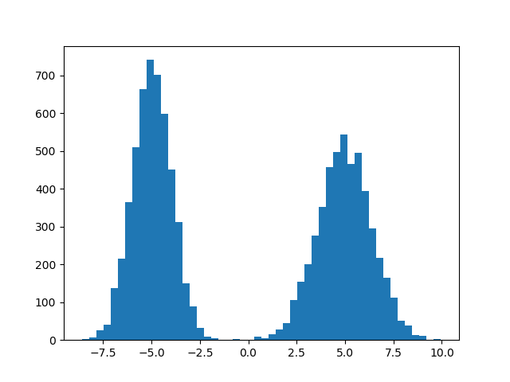
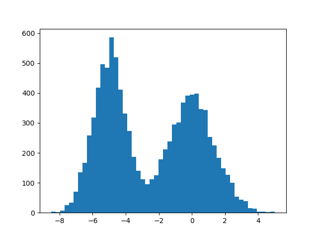
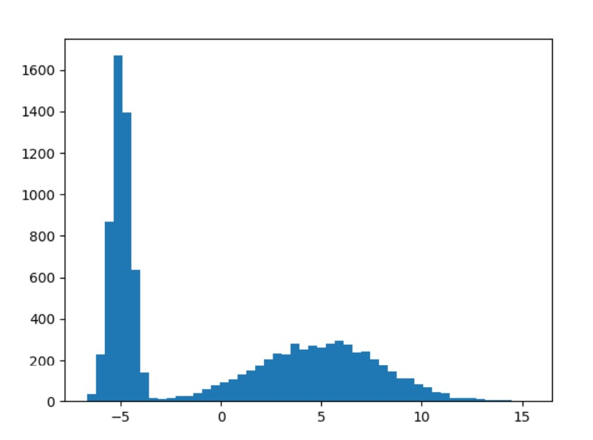
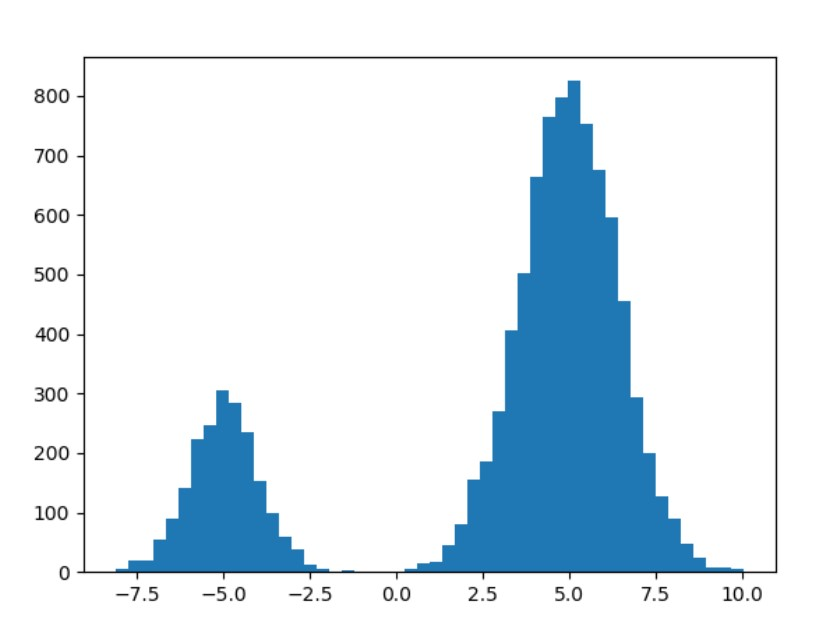
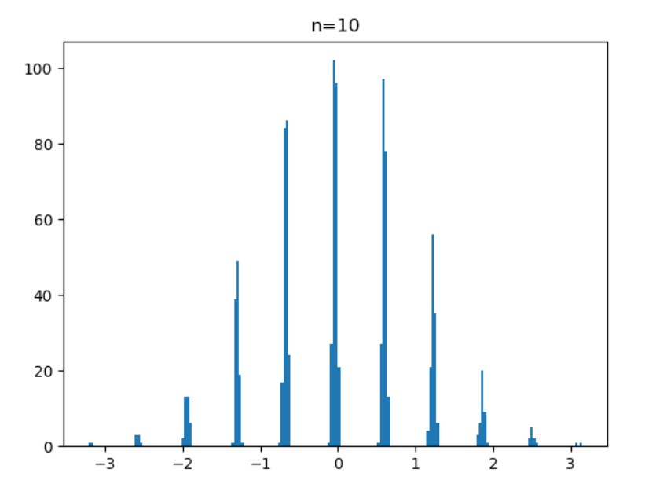
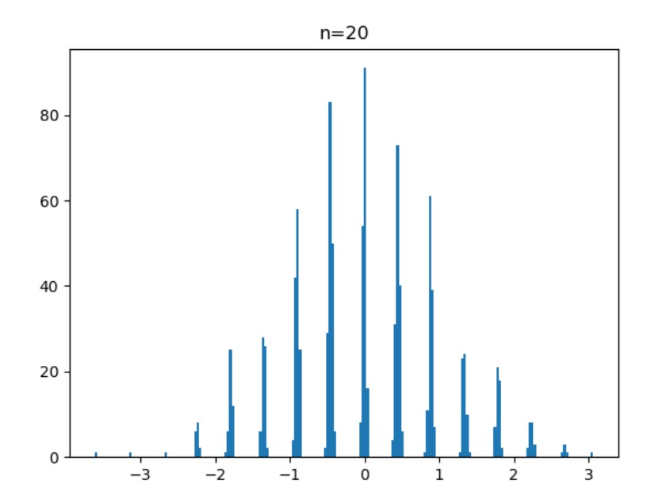
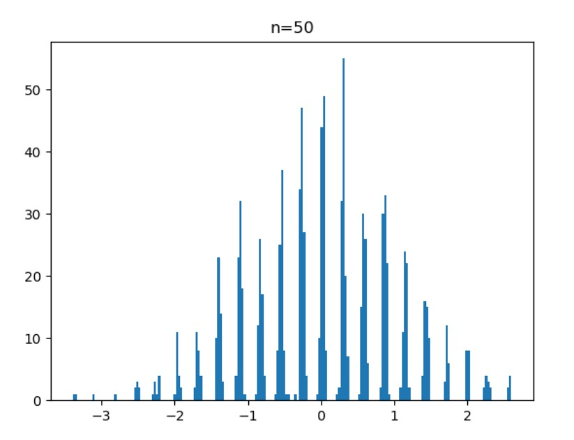
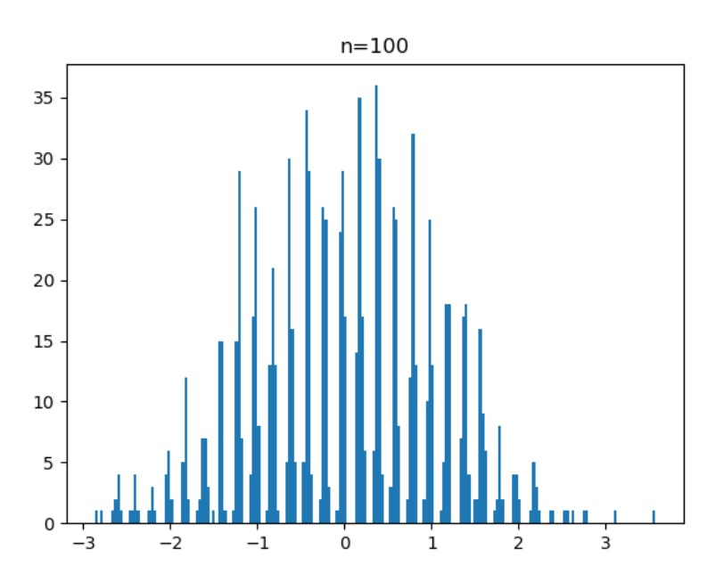
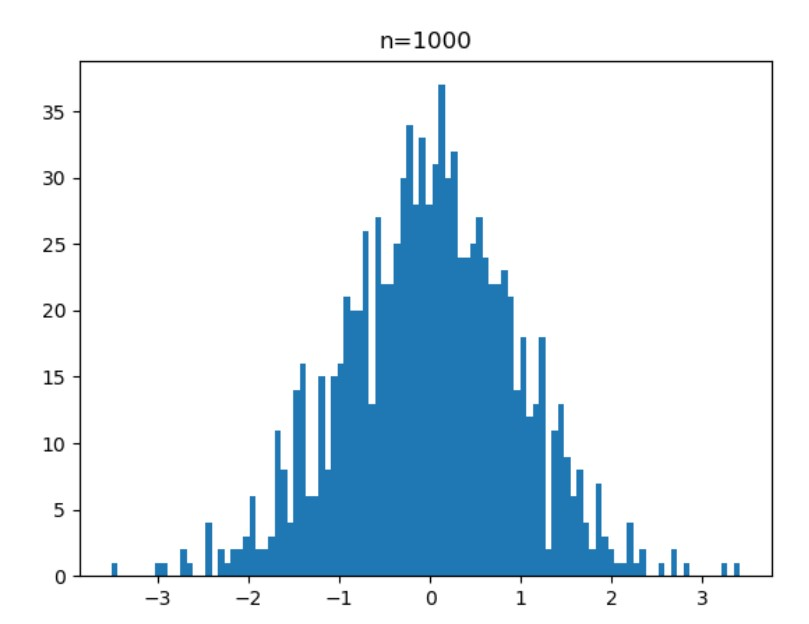
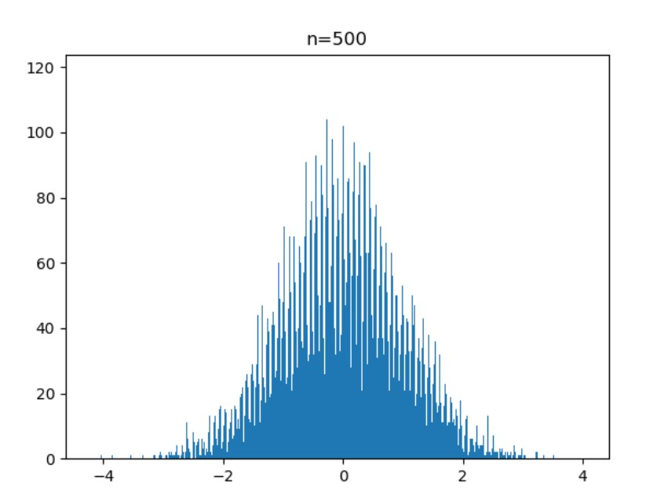

# 概率统计大作业
__谢哲 518030910092__

## 问题1
### 频率分布直方图
当取 $\mu_1=-5,\sigma_1=1,\mu_2=10,\sigma_2=1,p=0.5$时，可以得到如下的频率分布直方图：



### 讨论不同参数对其分布“峰”的影响
我们讨论如下几种情况：
- 改变$\mu$的值，使$\mu_1=-5,\sigma_1=1,\mu_2=5,\sigma_2=1,p=0.5$。
 
  

  可以发现，当$\mu$的值改变之后，图像中出现的两个峰之间的距离也有所改变。在上述改变下，混合高斯分布的两个峰之间的距离更近了。
- 改变$\sigma$的值，使$\mu_1=-5,\sigma_1=0.5,\mu_2=10,\sigma_2=3,p=0.5$。
  
  

  在这种情况下，我们发现两个峰的宽度均有很明显的改变。且$\sigma$越大，峰越宽。
- 改变$p$的值，使$\mu_1=-5,\sigma_1=1,\mu_2=10,\sigma_2=1,p=0.8$。

  

  在这种情况下，我们发现两个峰的面积出现了较大的变化。当$p$越大，右边的峰的面积越大。

### 解题思路和代码
我使用`Python`语言来求解这道题，使用科学计算库`numpy`来完成正态分布随机数的生成，并根据给出的公式：$Z=X+\eta Y$，生成混合高斯分布的随机数，并且使用绘图库`matplotlib`来绘制频率分布直方图。

代码如下：
``` python
import numpy as np
import matplotlib.pyplot as plt

# Input
m1 = eval(input('μ1:'))
s1 = eval(input('σ1:'))
m2 = eval(input('μ2:'))
s2 = eval(input('σ2:'))
p = eval(input('p:'))
data_size = 10000
# Generate Random Numbers
x = np.random.normal(m1, s1, data_size)
y = np.random.normal(m2, s2, data_size)
a = np.random.rand(data_size) < p
z = x + a * y
# Show
plt.hist(z, bins=50)
plt.show()

```

## 问题2
(在本题中，参数设定为：$\mu_1=-50,\mu_2=100,\sigma_1=1,\sigma_2=1,p=0.5$)
### $U_1,U_2,...,U_{1000}$的频率分布直方图
当参数设定为$n=10$时，得到的频率分布直方图如下。



### 不同的$n$下的频率分布直方图
- $n=10$

  

- $n=20$

  
  
- $n=50$

  

- $n=100$

  

- $n=1000$

  

通过这些图像，我们可以发现如下的规律：
1. 随机变量 $U_i$ 的频率分布直方图，实际上是由一个个“峰”组成的，而且峰和峰之间存在一定的间隔。
2. 通过改变不同的参数，可以发现这些峰的中心都在0处，且峰的高度随着$|u_i|$的增大不断减小。到两边，趋近于0，中间的峰的高度最大。
3. 随着$n$的增大，峰的数量不断增多，峰与峰之间的间隔减小。但是这些峰的顶部构成的整体的“包络面”形状相似。
4. 当$n$足够大时，由于峰与峰之间的间距已经小于频率分布直方图的小区间的长度，所以峰与峰时间的间隔无法清晰地看出来，当 $n=1000$ 时，这种现象已经极为明显，整体的图像已经看不出来各个峰之间的间隔了。但是，假如缩小直方图的区间长度，也可以粗略看出峰顶之间的间隙：



### 解题思路与代码
这道题，同样是用 `Python` 编写代码求解的。首先使用 `numpy` 生成 $n\times 1000$ 的符合混合高斯分布的随机数矩阵，之后计算出矩阵的均值与方差，并通过循环计算出 $U_i$ ，最后使用 `matplotlib` 绘制频率分布直方图。
代码如下：
``` python
import numpy as np
import matplotlib.pyplot as plt
# Parameters
m1 = -500
s1 = 1
m2 = 100
s2 = 1
p = 0.5
total_size = 1000
data_size = int(input('n:'))
# Data Generator
z = np.zeros((total_size, data_size))
u = np.zeros(total_size)
x = np.random.normal(m1, s1, (total_size, data_size))
y = np.random.normal(m2, s2, (total_size, data_size))
a = np.random.rand(total_size, data_size) < p
z: np.ndarray = x + a * y
# Calculate EZ and DZ
EZ = z.mean()
DZ = z.var()
# Calculate U_i with a loop
for i in range(total_size):
    z_sum = z[i].sum()
    u[i] = (z_sum - data_size * EZ) / np.sqrt(data_size * DZ)
# Show the plot
plt.hist(u, bins=100)
plt.title(f'n={data_size}')
plt.show()
```

## 感想
1. 通过这次概率统计的大作业，我对`混合高斯分布`这一分布有了更加深入的了解，并且对其参数与分布图像的关系有了更多的认识。
2. 通过程序绘制的图像，我了解了影响频率分布直方图与概率密度图像的联系与差别，并明白了如何使用频率分布直方图更好地反应随机变量的分布。
3. 通过编写程序生成变量，我对使用计算机辅助解决概率统计问题更为熟练，并掌握了一些数学库和图像库的使用方法。

## 致谢
感谢熊德文老师的悉心教导与富有探索价值的大作业，使我获益匪浅。感谢 `Python` 语言和数学计算库 `numpy` 、绘图库 `matplotlib` ，有了这些工具，让数学问题的解决有了更快、更好的方法。